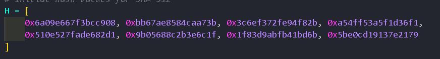
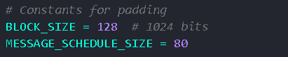
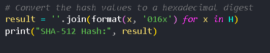

# Description

This is a simple implementation of SHA-512 in Python.

# SHA-512

SHA-512, which stands for Secure Hash Algorithm 512, is a cryptographic hash function.SHA-512 is known for its robust security and is widely used for various
cryptographic applications, including data integrity verification, password storage, and digital
signatures.

# Algorithm

### 1. Initialize constants:
Define initial hash values (H0 to H7).
Define round constants (K0 to K79).
### 2. Pre-processing:
a. Append padding to the input data to ensure its length is a multiple of 1024 bits.
b. Split the padded message into 1024-bit blocks.
### 3. For each block:
    a. Create a message schedule array (W[0] to W[79]) from the block.
    b. Initialize working variables (a to h) with the hash values (H0 to H7) from the previous block.
### 4. Main compression loop (80 rounds):
For i from 0 to 79:
T1 = h + Sigma_1(e) + Ch(e, f, g) + K[i] + W[i]
T2 = Sigma_0(a) + Maj(a, b, c)
h = g
g = f
f = e
e = d + T1
d = c
c = b
b = a
a = T1 + T2
### 5. Update the hash values:
H0 = H0 + a
H1 = H1 + b
H2 = H2 + c
H3 = H3 + d
H4 = H4 + e
H5 = H5 + f
H6 = H6 + g
H7 = H7 + h
### 6. Repeat steps 3-5 for each block in the message.
### 7. The final hash value (H0 to H7) is the SHA-512 hash of the input data.
### 8. Convert the hash value to its hexadecimal representation for the final result

# Working
### 1. Import Statements:

     imports the struct module, which is used for working with binary data. In this case, it's used for byte-order conversions when processing the message.

### 2.Initial Hash Values (H):

    These are the initial hash values (eight 64-bit words) as specified in the SHA-512 algorithm.

### 3.SHA-512 Constants (K):
    These are the 64 constant values used in the SHA-512 algorithm. These constants are derived from the first 80 prime numbers' square roots.

### 4.Constants for Padding:

BLOCK_SIZE represents the block size in bytes (1024 bits), and MESSAGE_SCHEDULE_SIZE is the size of the message schedule used in SHA-512.

### 5.SHA-512 Functions:

    *The code defines several functions used in the SHA-512 algorithm:
        -right_rotate(x, n): Right-rotates the input x by n bits.
        -ch(x, y, z): The logical function Ch used in SHA-512.
        -maj(x, y, z): The logical function Maj used in SHA-512.
        -sigma0(x): The sigma function σ0 used in SHA-512.
        -sigma1(x): The sigma function σ1 used in SHA-512.
        -epsilon0(x): The epsilon function ε0 used in SHA-512.
        -epsilon1(x): The epsilon function ε1 used in SHA-512.

### 6.Main Code for Hashing:

    The main code processes the user-provided string for SHA-512 hashing. It first takes user input and encodes it as bytes. It then applies padding using the pad_message function.

    The code processes the message in blocks of 1024 bits and follows the steps of the SHA-512 algorithm to calculate the hash. It initializes working variables a, b, c, d, e, f, g, and h and updates them within a loop.

###  Conversion and Output:
    The code converts the final hash values to a hexadecimal digest and prints the SHA-512 hash to the console.

# Conclusion
This code provides a Python implementation of the SHA-512 algorithm and demonstrates the step-by-step process of hashing a user-provided string. It's important to understand the functions, constants, and logic used to ensure a correct and secure implementation of the SHA-512 hash algorithm.
